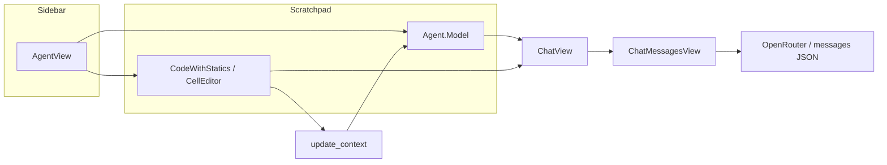

# Hazel coding agent — architecture notes

This document summarizes how the in-IDE coding agent is wired (model, context, chat UI, and tool results) to support future UI/UX work.

## Placement in the app

- The agent lives in the **sidebar** when `globals.settings.sidebar.panel` is `HelpfulAssistant` (`Sidebar.re` routes to `AgentView.view`).
- `AgentView.re` branches on `agent_globals.active_screen` (main menu vs chat). In **Scratch** and **Documentation** modes it takes the current scratchpad’s `agent` model and `editor` (via `scratchpad.editor.editor`, i.e. `CodeWithStatics.Model.t`) and renders `ChatView`.
- **Tutorial** and **Exercises** modes show a placeholder; the agent is not available there.

## Core modules (under `src/web/view/AgentCore/Agent.re`)

- **`Agent.Agent.Model`**: Top-level agent state, including `chat_system` (`Agent.ChatSystem`), prompting config, tool UI state, etc.
- **`Agent.Chat`**: One chat has a message tree (`message_map`, `root`, `current_child` traversal via `Chat.Utils.linearize`), per-chat **`agent_view`** (`AgentContext.Model.t` — which definition paths are expanded for the agent), **`agent_workbench`**, optional **`context`** message (latest system context snapshot), and **`current_view`** (messages, workbench, prompt, tools, agent editor / static errors “fullscreen” subviews, etc.).
- **`Agent.Message`**: Roles include `User`, `Agent(_)`, `System(Prompt | DeveloperNotes | Context | ApiFailure | RetryNote)`, and `ToolResult(...)`.
- **`Agent.ChunkedUIChat`**: Pure **projection** of the linearized message list into UI-oriented chunks (user bubbles, merged agent chunks with nested tool results, prompt/dev-notes/context strings). It does not own business logic; it’s a display adapter.

## Context snapshots (what the model “sees”)

- **`Message.Utils.mk_context_message`** builds a single system message whose `content` is XML-ish tagged text: `<context>` wrapping `<agentEditorView>` (fenced ``` body), `<staticErrorsInfo>`, `<testResultsInfo>`, `<workbenchTaskInfo>`, plus a fixed footer line telling the LLM not to reply to the snapshot.
- **`Agent.Agent.Update.update_context`** (in the same large `Agent` module) recomputes that payload from the live editor:
  - **Program text** for the API: `CompositionView.Public.print(~probe_map=editor.dynamics, editor.editor, curr_chat.agent_view)` — respects collapsed definitions according to `expanded_paths` and probe-aware text when refractors exist.
  - **Statics / tests / workbench** strings are assembled and sent through `Chat.Update.Action.UpdateContext`, which replaces the chat’s context message.

So the **string** in the context message and the **live editor + `agent_view`** are meant to stay in sync whenever context is refreshed; the UI can legitimately render the program from the live `CodeWithStatics` + `agent_view` to match what `print` would fold, without reparsing the fenced string.

## Chat UI stack

- **`ChatView.re`**: Header (new chat, history, settings), screen switch (chat vs history), and for the chat screen a **content** area plus optional **bottom bar**.
- **`ChatMessagesView.re`**: Renders `chunked_chat.log` (message list), and embeds a local **`ViewComponents`** module for fullscreen subviews (prompt, dev notes, **agent context**, tools list). **`AgentEditorView`** and **`StaticErrors`** both map to `ViewComponents.context_view` today.
- **`ChatBottomBar.re`**: Composer, branch controls, and shortcuts (e.g. open **Agent Context** when `chunked_chat.context != ""`).

## Tool results and Hazel segments

- Tool outcomes are stored as messages with role `ToolResult` carrying **`AgentToolResult.tool_result`** (tool name, args JSON, success, optional diff segments, plain `content` string).
- **`ToolResultView.re`** renders the expandable inline card; **`ToolResultView.render_segment`** is the shared path for read-only Hazel code: `Indentation.shallow_complete_segment` + `CodeViewable.view_segment` (same family as the diff “Before/After” segments).

## Recent UI direction: Agent Context editor block

- **`CompositionView.Public.segment_for_agent_context`**: Uses the same **zipper collapse** as `CompositionView.Public.print` (via shared `zipper_for_agent_context`), then `Select.all(z').selection.content` for a `Segment.t` suitable for `CodeViewable`.
- **Agent Context panel** strips the `<agentEditorView>…</agentEditorView>` block from the stored context string for the text remainder, and renders the program with **`ToolResultView.render_segment`** so it aligns visually with tool diff segments in chat.

## Data flow (simplified)



## Files worth bookmarking

| Area | Files |
|------|--------|
| Agent model & chat | `src/web/view/AgentCore/Agent.re` |
| Composition / print / segment | `src/haz3lcore/CompositionCore/CompositionView.re` |
| Chat shell | `src/web/view/AgentView/ChatView.re`, `ChatBottomBar.re` |
| Messages & context UI | `src/web/view/AgentView/ChatMessagesView.re` |
| Tool inline UI | `src/web/view/AgentView/ToolResultView.re` |
| Agent sidebar entry | `src/web/app/sidebar/Sidebar.re`, `src/web/view/AgentView/AgentView.re` |
| Styles (chat/agent) | `src/web/www/style/agent/agent-chat-messages.css` |
