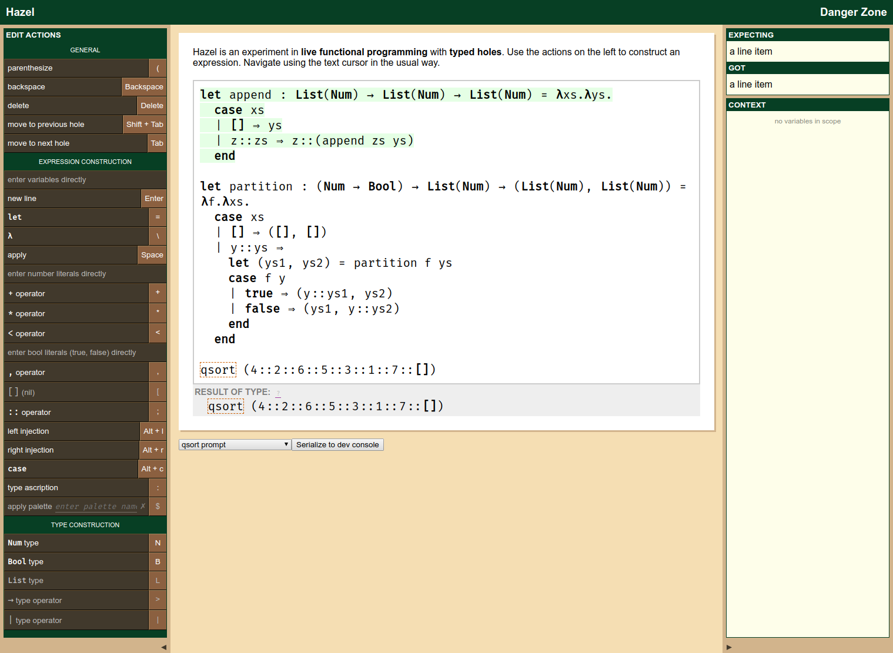

# Hazel  

Hazel is a live functional-programming environment rooted in the principles of
type theory. You can find the relevant papers and more motivation at [the Hazel
website](http://hazel.org/).

You can try Hazel online with either the
[stable](https://hazel.org/build/master/index.html) or
[development](https://hazel.org/build/dev/index.html) version.

### Demo

- [Live Functional Programming with Typed Holes (POPL 2019)](https://www.youtube.com/watch?v=q58NFuUr0GU)

### Screenshot

Note that this screenshot is of the `master` (i.e., stable) branch circa 2019.
Hazel is under rapid development, so this screenshot may not reflect the most
recent version.

<!-- TODO: screenshot with a hole -->
<!-- TODO: animated gif -->

## Building and Running Hazel

### Short version

If you already have `ocaml` version 4.08.1 and least version 2.0 of `opam`
installed, you can build Hazel by running the following commands.

- `git clone git@github.com:hazelgrove/hazel.git`
- `cd hazel`
- `make deps`
- `make dev`

To run Hazel, run the command `make echo-html`, which will display a filename.
Then use your preferred browser to open that file.

### Long Version

If you are unfamiliar with `ocaml` or `opam`, do not have them installed, or
just get stuck, we recommend you follow the step-by-step installation
instructions contained in [INSTALL.md](INSTALL.md).

## Contributing

### Learning ReasonML

This link lets you type OCaml and see what the corresponding ReasonML syntax is:
<https://reasonml.github.io/en/try>.

This is useful if you are trying to figure out the ReasonML syntax for something
that you know the OCaml syntax for.

### Suggested Extensions for VS Code

Most of our team uses VisualStudio Code to write code.  If you use VS Code, here
are a few extensions that might be helpful.

- These extensions provide support for editing ReasonML and Dune source code:

  - [reason-vscode](https://marketplace.visualstudio.com/items?itemName=jaredly.reason-vscode)
  - [Dune](https://marketplace.visualstudio.com/items?itemName=maelvalais.dune)

- Due to Reason's poor parse errors, unbalanced parentheses can be difficult
  to find.  The following extensions help with that.

  - [Bracket Pair Colorizer 2](https://marketplace.visualstudio.com/items?itemName=coenraads.bracket-pair-colorizer-2)
  - [Indenticator](https://marketplace.visualstudio.com/items?itemName=sirtori.indenticator)
  - [indent-rainbow](https://marketplace.visualstudio.com/items?itemName=oderwat.indent-rainbow)

### Build System Details

Hazel is implemented in Reason (a dialect of OCaml) and is compiled to
Javascript for the web browser via the `js_of_ocaml` compiler.

Though, `make` targets are provided as a convenience, they mostly translate to
`dune` commands.

Invoking `make` by itself is equivalent to invoking `make dev`. With these
commands we pass additional flags to `js_of_ocaml` that cause the insertion of
comments that map locations in the generated JS to locations in the source
files. This is useful for debugging purposes.

`make dev` also auto-formats Reason source files using `refmt` (this is what the
`@src/fmt` alias is for). This ensures code from all contributors follows the
same style.

The `make dev` and `make release` commands do three things:

1. Generate some parsers using `menhir`.
2. Compile the Reason code to OCaml bytecode using the OCaml compiler.
3. Compile the OCaml bytecode to JavaScript
   (`_build/default/src/hazelweb/www/hazel.js`) using `js_of_ocaml`.
