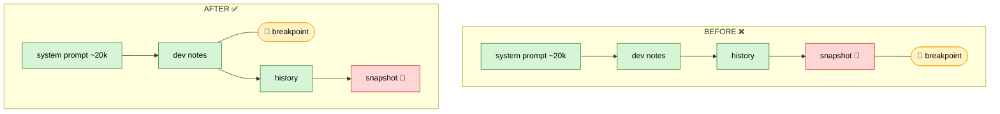

# Prompt Caching — Research Report & Findings

_Living document. Audience: research team / advisors. Covers the full investigation into
prompt caching for the Hazel coding agent on OpenRouter, including the reasoning, the
hypotheses we tested and rejected, the diagnostic methodology, the definitive evidence, the
root cause, and open next steps._

- **2026-06-09** — Phase 1 shipped & verified live (~95% cache reads on `anthropic/claude-sonnet-4.6`).
- **2026-06-18** — Phase 2 (advancing history breakpoint) implemented.
- **2026-06-23/28** — Built a diagnostic harness; **proved Phase 2 is blocked by OpenRouter's
  OpenAI-compat path** for the message role our breakpoint landed on (tool results).
- **2026-06-28** — Tested re-anchoring on **user** messages (OpenRouter docs show user-message
  support). **Failed** — OpenRouter drops `cache_control` on `user` too. **Definitive: only
  `system` breakpoints are honored on OpenRouter+Anthropic; cumulative history caching needs
  native-Anthropic routing.**
- **2026-06-28 (review)** — Found a concrete remedy: OpenRouter's **Anthropic-native endpoint**
  ("Anthropic Skin", `/api/v1/messages`) speaks Anthropic's native wire format and should honor
  per-block `cache_control` on all roles while keeping OpenRouter (§8). Also surfaced supporting
  research ([arXiv 2601.06007](https://arxiv.org/abs/2601.06007)) indicating system-prompt-only
  caching is empirically near-optimal for agentic workloads — so floor-only is a defensible
  resting point.

---

## 0. TL;DR for the team

- **Prompt caching** lets us re-send a long, mostly-unchanged prompt each turn and pay ~0.1× input
  price on the unchanged prefix instead of 1× — roughly **10× cheaper input per turn** on the
  cached portion.
- **Phase 1 (live, working):** one cache breakpoint on the stable `tools + system prompt + dev-notes`
  prefix. Caches **~93% of a typical payload** (~22.3k of ~24k tokens). This is the big win and it
  works.
- **Phase 2 (attempted):** a second, *advancing* breakpoint to also cache the **growing
  conversation history**. On OpenRouter+Anthropic this **does not work** — but **not because our
  code is wrong**. We proved with a diagnostic harness that our serialization is byte-correct and
  the breakpoint is on the wire; OpenRouter's gateway drops it.
- **Root cause:** OpenRouter routes Anthropic models through an **OpenAI-compatible wire format**
  (`/api/v1/chat/completions`). In that translation, Anthropic only honors `cache_control` on
  **`system`** content; markers on **`user`** and **`tool`** messages are silently dropped — and the
  agentic-loop history we wanted to cache lives entirely on `user`/`tool`/`assistant` messages.
- **Status (resolved):** we tested anchoring on the last `tool` message (§3.6) *and* the last `user`
  message (§4); **both dropped**. **Definitive: only `system` breakpoints work on
  OpenRouter+Anthropic.** The floor (Phase 1, ~93%) is the achievable ceiling on OpenRouter; the
  advancing breakpoint is a correct-but-dormant no-op.
- **Can we still get it?** Yes, two real options (§8): **(a)** switch Claude traffic to OpenRouter's
  **Anthropic-native endpoint** ("Anthropic Skin", `https://openrouter.ai/api/v1/messages`), which
  speaks Anthropic's native wire format and passes per-block features through untouched — keeps
  OpenRouter; **(b)** route to Anthropic directly. Both honor `cache_control` on all roles.
- **But should we?** Recent research ([Don't Break the Cache, arXiv 2601.06007](https://arxiv.org/abs/2601.06007))
  found that for long-horizon agentic tasks, **caching only the system prompt and keeping dynamic
  tool results *out* of the cached prefix is the most consistent strategy (41–80% savings)** —
  naively caching everything (incl. tool results) can even *raise* latency. So our forced floor-only
  outcome is **close to the empirically-recommended strategy**, and Phase 2's marginal upside is
  smaller than it first appears.

---

## 0.5 Plain-English version (for anyone)

Why Claude's chat history won't cache through OpenRouter today, and the fix:

- Now: we talk to Claude in "OpenAI language."
- Claude's caching ignores history written in that language.
- Only the system prompt gets cached.
- Other endpoint: talk in Claude's "native language."
- Same OpenRouter, different door + different phrasing.
- In native language, caching listens to everything.
- So the whole chat history caches.
- Cost: we write a second translator for Claude.
- Worth it mainly for long conversations.

And how the other providers behave:

- Gemini, OpenAI, DeepSeek, Grok: cache **automatically** — no markers from us.
- They decide what to cache; we saw Gemini do it **inconsistently** but free.
- Only **Claude** needs us to place markers by hand.
- That manual marking is the part OpenRouter's default door breaks.

---

## 1. Background: how prompt caching works

Caching is a **strict prefix match** over the fully-rendered request. The render order is:

```
tools  →  system  →  messages[]   (this whole sequence is the "prompt")
```

A `cache_control: {"type": "ephemeral"}` **breakpoint** marks a position. Everything *before* the
breakpoint is cached cumulatively. On the next request, if that same prefix is re-sent **byte-for-
byte**, it is served from cache.

Billing per turn (Anthropic):

| Portion of the request | Price |
|---|---|
| Unchanged prefix re-read from cache | **~0.1×** input |
| New tokens written into the cache this turn (the delta) | **~1.25×** input (5-min TTL) / **2×** (1-hr TTL) |
| Tail after the last breakpoint (e.g. our volatile snapshot) | **1×** input |
| Output tokens | normal output price |

Key properties (all load-bearing for this investigation):

- **Strict prefix match.** A single byte change *anywhere* in the prefix invalidates everything
  after it. Timestamps, reordered JSON keys, a changed tool list → cache miss.
- **Breakpoint = boundary annotation, not content.** The `cache_control` marker itself is not part
  of the cached tokens; it just declares a cache boundary. (This is why the *content* must be
  byte-stable, but moving the marker around is fine.)
- **20-block lookback.** Each breakpoint walks back at most ~20 content blocks to find a prior cache
  entry. Long single turns (many tool-call/result pairs) can blow past this.
- **Max 4 breakpoints** per request.
- **5-minute sliding TTL**, refreshed free on every hit.

### What "the prompt" means (a recurring team question)
"The prompt" is the **entire input** (`tools → system → all messages`), not just the system prompt.
"Cache the system prompt" and "cache the history" are the *same feature* at different breakpoint
positions. A breakpoint near the end caches everything before it cumulatively.

---

## 2. Phase 1 — the original fix (live, verified)

### The bug
Our single cache breakpoint sat on the **context snapshot** — a per-turn snapshot of live program
state, appended *last* and regenerated every turn. Because caching is a prefix match, a breakpoint
on volatile last content gets ≈ zero hits: we paid the 1.25× write premium every turn and almost
never read it back.

### The fix
Moved the breakpoint **off the snapshot** onto the stable **dev-notes** message (which sits right
after the system prompt). Now the prefix `tools + system prompt + dev-notes` caches across turns.
The snapshot stays last and uncached.



### Result (verified live)
`cache_read 22,293 / prompt 23,436` → **~95% of every request served at 0.1×** (~10× cheaper input
per turn). Implemented via a `cache_anchor` flag on the OpenRouter message type (`OpenRouter.re`)
set on the dev-notes message (`Message.re`).

---

## 3. Phase 2 — advancing history breakpoint (the investigation)

### 3.1 Goal
Phase 1 caches the *static* prefix. Phase 2 wanted to also cache the **growing conversation** so
prior history reads at 0.1× instead of full price. Design (per the spec):

1. **Advancing breakpoint.** Each request, place a second `cache_control` on the **last history
   message**, just before the volatile snapshot. This position moves forward every request; the
   20-block lookback finds the previous request's write.
2. **Mark every request, not every user turn.** Agentic loops issue one API request per tool
   round-trip; marking every request keeps consecutive writes 1–3 blocks apart (inside the lookback
   window).
3. **Keep the Phase 1 dev-notes breakpoint as a floor.** When a lookback window is exhausted, the
   search resumes at the next earlier explicit breakpoint. Worst case degrades to Phase 1 pricing.
4. **History must stay byte-stable and append-only.** Any mid-history edit invalidates the cache
   from that point down.
5. **Per-conversation `session_id`.** Pins OpenRouter sticky routing to one provider so the cache
   (which does not transfer between Anthropic/Bedrock/Vertex) keeps hitting.

### 3.2 Implementation
- `Chat.api_messages_for_openrouter` (`src/web/view/agentCore/Chat.re`) — sets the advancing
  `cache_anchor` and is the single chokepoint routed through by all 4 main request paths (initial,
  follow-up, API-error retry, empty-reply retry) plus compaction.
- `OpenRouter.json_of_message` (`src/util/OpenRouter.re`) — renders the marker. Non-blank content is
  rendered as a stable single-element `[{type:text,...}]` array (see §3.4) and the `cache_control`
  key is toggled on/off.
- `OpenRouter.Payload` — added an optional top-level `session_id` body field, threaded from the chat
  id at every request path.
- `supports_cache_control` — provider gate widened from `anthropic/` only to `anthropic/`,
  `google/`, `qwen/` (the families documented to support explicit breakpoints with identical
  syntax). Auto-caching providers (OpenAI/DeepSeek/Grok) get the field stripped.

### 3.3 Symptom
Cache reads stayed pinned at the Phase 1 floor (~22.3k) while the conversation grew; the growing
history was never cached. `cache_creation` was `null` on every request — i.e. **nothing was ever
written to cache beyond the floor.**

### 3.4 Hypotheses tested and **rejected** (the reasoning trail)

This is the part worth keeping for the team — we ruled out several plausible client-side causes
before landing on the provider:

1. **"The advancing breakpoint flips a message between string and array form as it stops being the
   anchor, breaking byte-stability."** Plausible: our default rendered content as a JSON *string*
   and only the anchored message as a `[text]` array, so a just-anchored message flipped
   `array → string` next request. **Fix applied:** always render non-blank content as a `[text]`
   array and toggle only the `cache_control` key, so a message serializes identically whether or not
   it holds the marker. **Result: no change** — cache still flat. → Rejected as the cause.
2. **"The advancing breakpoint isn't being placed at all."** Tested by logging the breakpoint
   indices on the wire. **Result: `breakpoints=[1,N]`** — both the floor (1) and the advancing
   breakpoint (N) *are* present. → Rejected.
3. **"Our message bytes are unstable / not append-only."** Tested by computing the byte-stable
   common prefix vs. the previous request. **Result: common prefix grows append-only** (43,436 →
   44,505 chars). → Rejected; our serialization is correct.
4. **"Minimum cacheable size / 20-block lookback gap."** The incremental delta exceeded the minimum,
   and we mark every request (1–3 blocks apart), so the lookback isn't exhausted. → Not the cause.

After rejecting all client-side causes, the remaining explanation was provider-side: **the marker
reaches OpenRouter but is not honored.**

### 3.5 The diagnostic harness (`OpenRouter.CacheDiag`)
To separate "are *our* bytes correct?" from "did the *provider* cache them?", we built a harness
(`src/util/OpenRouter.re`, module `CacheDiag`, **off by default** — set `log := true`). Per request
it logs:

- **breakpoint indices** carrying `cache_control` on the wire,
- the **byte-stable common prefix** of message *content* vs. the previous request (deliberately
  ignoring the moving `cache_control` marker, so it measures content stability),
- the response's **`cache_read` / `cache_creation`**.

Interpretation:
- common prefix **grows** + cache_read **flat** → our bytes are fine, **provider dropped the
  breakpoint**.
- common prefix **falls/jumps** → a client-side serialization instability (it didn't).

### 3.6 Definitive evidence

**`anthropic/claude-sonnet-4.6` (the target case):**
```
breakpoints=[1,4]   common_prefix=0ch      payload=44069ch  cache_read=22293  cache_creation=null
breakpoints=[1,6]   common_prefix=43436ch  payload=44299ch  cache_read=22293  cache_creation=null
breakpoints=[1,8]   common_prefix=43708ch  payload=44526ch  cache_read=23081  cache_creation=null
breakpoints=[1,10]  common_prefix=43935ch  payload=44909ch  cache_read=22293  cache_creation=null
breakpoints=[1,12]  common_prefix=44241ch  payload=45221ch  cache_read=22293  cache_creation=null
breakpoints=[1,14]  common_prefix=44505ch  payload=45862ch  cache_read=22293  cache_creation=null
```
Reading it:
- `breakpoints=[1,N]` → **both** markers on the wire; we *do* send the advancing breakpoint.
- `common_prefix` climbs append-only → our serialization is **byte-stable and correct**.
- `cache_read` pinned at the floor (~22,293), `cache_creation` always `null` → the provider **never
  caches the growing history**.

**`google/gemini-3-flash-preview` (cross-check):**
```
breakpoints=[1,4]   common_prefix=0ch      cache_read=0      cache_creation=null
breakpoints=[1,6]   common_prefix=43496ch  cache_read=15364  cache_creation=null
breakpoints=[1,8]   common_prefix=43688ch  cache_read=0      cache_creation=null
```
Erratic `cache_read` (0 → 15,364 → 0), `cache_creation` null — Gemini's **implicit** automatic
caching doing best-effort, *not* driven by our explicit markers. Outside our control.

### 3.7 Root cause
**OpenRouter routes Anthropic models through an OpenAI-compatible wire format
(`chat_completions`).** In that translation, Anthropic honors `cache_control` only on certain
message roles; markers on others are silently dropped. Our **floor** sits on a **system** (dev-notes)
message → honored (22.3k cached). Our **advancing** breakpoint lands on a **`tool` (tool-result)**
message in the agentic loop → **dropped** → no write (`cache_creation: null`), no incremental read.

This is **not an Anthropic limitation** — Anthropic natively supports cumulative multi-turn history
caching. It is a property of OpenRouter's gateway translation. Corroborated by multiple independent
third-party reports (see Sources).

### 3.8 Correction (important — the "only system" claim was too strong)
After the diagnosis we re-read OpenRouter's **official** prompt-caching docs. They show
`cache_control` examples on **both system AND user messages**:

```json
{ "role": "user", "content": [
  { "type": "text", "text": "Given the book below:" },
  { "type": "text", "text": "HUGE TEXT BODY", "cache_control": { "type": "ephemeral" } }
]}
```

So the documented support is **system + user** (assistant: not shown; **tool/tool_result: not shown
anywhere**). At this point we hypothesized our failure was specific to the breakpoint landing on a
**tool** message — the one undocumented role — **not** a blanket "non-system" wall, and that
re-anchoring on a `user` message might work. **§4 tested that hypothesis and disproved it:** the
user-message marker is dropped too, so the documented user support does *not* hold through
OpenRouter's OpenAI-compat path. The "only system works" conclusion stands — it just needed our own
data, not the third-party reports, to confirm.

---

## 4. Experiment: user-message anchor — **FAILED** (2026-06-28)

**Hypothesis:** OpenRouter's docs show `cache_control` examples on **user** messages, so anchoring
the advancing breakpoint on the **last user message** (instead of the tool result) might let
cumulative history cache.

**Change:** `Chat.api_messages_for_openrouter` was temporarily switched to set `cache_anchor` on the
last **user** message, then a **multi-turn** conversation was run on `anthropic/claude-sonnet-4.6`
with the harness on.

**Result — it did not work.** Harness output (multi-turn, advancing user-message anchor):
```
breakpoints=[1,2]   common_prefix=0ch      cache_read=22293  cache_creation=null
breakpoints=[1,6]   common_prefix=43988ch  cache_read=22293  cache_creation=null
breakpoints=[1,12]  common_prefix=44782ch  cache_read=22293  cache_creation=null
```
The advancing breakpoint advanced across turns onto **user** messages (index 2 → 6 → 12), the common
prefix grew append-only, yet **`cache_read` stayed pinned at the system floor (22,293) and
`cache_creation` was null** — no write, no incremental read. **So OpenRouter drops `cache_control` on
`user` messages too**, despite the user-message example in its own documentation.

**Conclusion (definitive).** On OpenRouter + Anthropic, **only `system`-message breakpoints are
honored** — empirically confirmed for `tool` (§3.6) *and* `user` (here). **Cumulative history caching
is not achievable through OpenRouter's OpenAI-compat path with any non-system breakpoint.** The
documented user-message support does not hold in this routing path. We reverted to the canonical spec
design (advancing breakpoint on the last history message), which is a **no-op on OpenRouter** but
correct and ready to activate under native-Anthropic routing.

**Path to cumulative history caching: reach Anthropic in its native wire format** — either
OpenRouter's own Anthropic-native "Anthropic Skin" endpoint (keeps OpenRouter) or the direct
Anthropic API. Both honor per-block `cache_control` on all roles. See §8 for the ranked remedies.

**Side finding (fixed):** the chat-title generator hard-coded `google/gemini-2.0-flash-lite-001`,
which now 404s on OpenRouter (`"No endpoints found"`) — harmless to the chat (a side request) but it
silently broke auto-naming. Swapped for `google/gemini-3.1-flash-lite` (verified live).

---

## 5. Where caching helps vs. doesn't (cost model)

| Scenario | Floor (Phase 1) | Advancing history (Phase 2) |
|---|---|---|
| Static prefix (tools + system + dev-notes) | ✅ cached ~22.3k | n/a |
| Multi-turn chat (prior user/assistant turns) | floor only | ❌ dropped on OpenRouter (§4); ✅ only via native routing (§8) |
| Single-turn agentic tool loop (accumulating tool results) | floor only | ❌ tool messages dropped by OpenRouter |
| Volatile per-turn snapshot (last message) | never cached (by design) | never cached (by design) |

**Practical takeaway:** Phase 1 already controls the bulk of cost (~93% of payload). Phase 2's
marginal value is large only for **long multi-turn** conversations; for short or single-turn-tool-
heavy sessions it adds little even in the best case.

**Research validation.** [*Don't Break the Cache* (arXiv 2601.06007)](https://arxiv.org/abs/2601.06007),
an empirical study across OpenAI/Anthropic/Google on a multi-turn agentic benchmark, found that
**caching only the system prompt and deliberately keeping dynamic tool results *out* of the cached
prefix gave the most consistent savings (41–80%)** — and that naively caching *everything* (including
tool results) sometimes *increased* time-to-first-token. Our Phase 1 floor (cache the static prefix,
leave the volatile snapshot and tool churn uncached) is essentially that recommended strategy. So the
OpenRouter limitation forces us into a configuration the literature already favors, and Phase 2's
unrealized upside is smaller than the intuition "cache more = cheaper" suggests.

---

## 6. Which models have caching (and how)

**Quick answer — who caches on OpenRouter:**

- ✅ **Automatic, no work from us** (caches on its own): **OpenAI**, **Google Gemini**, **DeepSeek**,
  **Grok (xAI)**, **Moonshot**, **Groq (Kimi)**. We just send the request; the provider caches
  repeated prefixes itself. (Gemini was inconsistent in our tests, but free.)
- ✍️ **Explicit — we must place `cache_control` markers**: **Anthropic (Claude)**, **Alibaba Qwen**,
  **Google Gemini (standard / non-2.5)**. This is the manual path, and the one OpenRouter's
  OpenAI-compat door breaks for non-`system` messages (the whole subject of this doc).
- ❌ **No caching**: any provider/model that offers none — you pay full input price every request.

**Pricing detail:**

| Provider | Mechanism | Min size | Write | Read |
|---|---|---|---|---|
| **Anthropic** | explicit `cache_control` (what we use) | 1,024–4,096 tok by model | 1.25× (5-min) / 2× (1-hr) | 0.1× |
| **Google Gemini** | explicit (Gemini standard) / implicit (2.5) | model-specific | input + storage | discounted |
| **Alibaba Qwen** | explicit `cache_control` | — | charged multiplier | discounted |
| **OpenAI** | automatic / implicit | 1,024 tok | **free** | 0.25×–0.5× |
| **DeepSeek / Grok / Moonshot / Groq** | automatic / implicit | — | free | discounted |

Auto-caching providers ignore (don't error on) the `cache_control` field; OpenRouter strips it for
non-allowlisted providers in our code regardless. **Takeaway:** most models "just cache" for free;
**Claude is the one that needs manual markers** — which is exactly why it's the hard case here.

---

## 7. Constraints & gotchas (carry-forward)

- **Strict prefix match** — editing mid-history (compaction, clipping stale views, re-rendering)
  invalidates everything below the edit. Keep history append-only; batch edits.
- **Deterministic serialization** — unstable JSON key ordering (e.g. in tool-call args) silently
  breaks caching. We serialize args once and reuse them.
- **Don't mark thinking blocks** — they can't carry `cache_control`; cached implicitly with
  surrounding content. (We never send thinking blocks upstream anyway.)
- **OpenRouter role limitation** — through OpenRouter's OpenAI-compat path, `cache_control` is
  honored **only on `system`** for Anthropic; `user` and `tool` markers are empirically dropped (the
  OpenRouter docs *claim* user support, but it does not hold in practice — §4). This is the crux of
  Phase 2 and is bypassed by OpenRouter's Anthropic-native endpoint (§8).
- **Sticky routing** — caches don't transfer between Anthropic/Bedrock/Vertex; `session_id` pins one
  provider.

---

## 8. Remedies & next steps

To get cumulative history caching, the breakpoint must reach Anthropic in its **native wire format**
(where `cache_control` on all roles is honored), instead of OpenRouter's OpenAI-compat translation.
Ranked by effort/realism:

1. **★ OpenRouter "Anthropic Skin" (native endpoint) — keeps OpenRouter, most promising.**
   OpenRouter exposes an **Anthropic Messages API-compatible endpoint** at base
   `https://openrouter.ai/api` (i.e. `POST /api/v1/messages`), which it calls the *Anthropic Skin*:
   *"Claude Code speaks its native protocol straight to OpenRouter, and the Skin handles model
   mapping and passes advanced features through untouched"* — explicitly listing native tool use,
   thinking blocks, streaming, and multi-turn context. Because it's the **native** format, per-block
   `cache_control` on `user`/`tool`/`assistant` content blocks should be honored (the exact thing
   OpenRouter's OpenAI path drops). **Cost to us:** build the Claude request in Anthropic's Messages
   shape for this path (top-level `system`, `tool_result` blocks inside `user` messages, content as
   block arrays) — a separate serializer for Claude, but no new vendor relationship or key. **Verify
   first** with the `CacheDiag` harness pointed at `/api/v1/messages`; the docs don't *explicitly*
   promise caching passthrough, so confirm before committing. *(Highest value; do this next.)*
2. **Direct Anthropic API** — same native format, straight to `api.anthropic.com`. Fully reliable,
   but adds a separate key/endpoint/billing and loses OpenRouter's one-key multi-provider routing for
   Claude. Fallback if (1)'s passthrough doesn't include caching.
3. **(Long-shot, OpenRouter OpenAI-path) System-boundary marker** — insert a stable `system` message
   at the history/snapshot boundary to carry the breakpoint (system is the only honored role on that
   path). Likely also dropped (mid-conversation `system` is a newer Anthropic beta and OpenRouter may
   not forward it), but cheap to test with the harness.
4. **Do nothing (defensible).** Per §5's research validation, system-prompt-only caching is
   near-optimal for agentic workloads; the floor already captures ~93%. Only pursue (1)/(2) if
   long-conversation cost is materially painful.

**Also:**
- ~~Fix the chat-title generator (`google/gemini-2.0-flash-lite-001` 404s)~~ — **done**: swapped to
  `google/gemini-3.1-flash-lite` (verified live).
- **Shrink the volatile snapshot** — it's re-sent at full price every turn regardless of caching;
  trimming/diffing it is an in-our-control lever orthogonal to all of the above.
- **1-hour TTL** for >5-min think-gaps; confirm OpenRouter's real read rate on an invoice.

---

## 9. Code / file map

| Concern | Location |
|---|---|
| `cache_anchor` flag on the OpenRouter message type | `src/util/OpenRouter.re` (`Message.Model.t`) |
| Marker rendering (multipart `[text]` + `cache_control` toggle) | `src/util/OpenRouter.re` (`json_of_message`) |
| Provider gate (`anthropic/`, `google/`, `qwen/`) | `src/util/OpenRouter.re` (`supports_cache_control`) |
| Top-level `session_id` body field | `src/util/OpenRouter.re` (`Payload`) |
| Diagnostic harness | `src/util/OpenRouter.re` (`CacheDiag`, off by default) |
| Floor anchor on dev-notes | `src/web/view/agentCore/Message.re` (`mk_developer_notes_message`) |
| Advancing anchor placement | `src/web/view/agentCore/Chat.re` (`api_messages_for_openrouter`) |
| Request dispatch paths (all routed through the helper) | `src/web/view/agentCore/AgentUpdate.re` |
| Per-message token + cache chip UI | `src/web/view/agentView/ChatMessagesView.re` (`render_token_chip`) |

---

## 10. Sources

- [1] [Anthropic — Prompt Caching](https://platform.claude.com/docs/en/build-with-claude/prompt-caching)
- [2] [Claude Code — Prompt Caching](https://code.claude.com/docs/en/prompt-caching)
- [3] [arXiv 2601.06007 — *Don't Break the Cache: An Evaluation of Prompt Caching for Long-Horizon Agentic Tasks*](https://arxiv.org/abs/2601.06007) — empirical study; system-prompt-only caching (excluding dynamic tool results) gives the most consistent savings (41–80%)
- [4] [OpenRouter — Prompt Caching (best practices)](https://openrouter.ai/docs/guides/best-practices/prompt-caching) — shows `cache_control` examples on system + user (user does **not** hold in practice — §4)
- [5] [OpenRouter — Anthropic Skin / Claude Code setup](https://openrouter.ai/blog/tutorials/claude-code-openrouter/) — the Anthropic Messages-API-compatible endpoint (`ANTHROPIC_BASE_URL=https://openrouter.ai/api`) that "passes advanced features through untouched"; the §8 remedy
- [6] [OpenRouter — Anthropic models](https://openrouter.ai/anthropic)
- [7] [PromptHub — provider caching comparison](https://www.prompthub.us/blog/prompt-caching-with-openai-anthropic-and-google-models)
- [8] [DigitalApplied — Prompt Caching in 2026](https://www.digitalapplied.com/blog/prompt-caching-2026-cut-llm-costs-engineering-guide) (practitioner guide)
- [9] [OpenRouter Gemini caching announcement](https://x.com/OpenRouterAI/status/1914699401127157933)
- [10] [litellm #15345 — "move cache_control to content blocks for claude/gemini"](https://github.com/BerriAI/litellm/pull/15345)
- Third-party reports of OpenRouter+Anthropic non-system `cache_control` being dropped:
  [Zed #52576](https://github.com/zed-industries/zed/issues/52576) ·
  [OpenRouter ai-sdk-provider #35](https://github.com/OpenRouterTeam/ai-sdk-provider/issues/35) ·
  [opencode #1245](https://github.com/anomalyco/opencode/issues/1245) ·
  [microsoft/vscode #312939](https://github.com/microsoft/vscode/issues/312939) (BYOK Claude no caching) ·
  [hermes-agent #20957](https://github.com/NousResearch/hermes-agent/issues/20957) (chat_completions api_mode)
