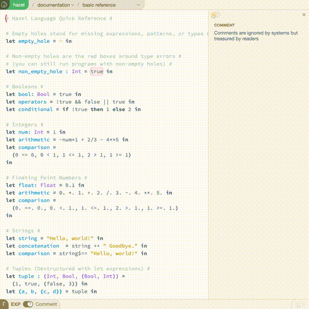

# TODO: Write this

Browser automation for hazel



```typescript
(async () => {
	const controller = new HazelController();
	await controller.launch("http://localhost:8000", true);

	// Select "Exercises" mode
	await controller.selectMode("Exercises");

	// Get all cells
	const cells = await controller.getCells();

	// edit the first cell with id "YourImpl"
	const codeCell = cells.find((cell) => cell.ids.includes("YourImpl"))!;
	await codeCell.scroll();

	console.log("Original content:", await codeCell.getContent());
	await codeCell.clearContent();
	await codeCell.typeString(
		'let my_str = "this is automatically inserted content"\nin my_str ++ my_str',
		100,
	);
	console.log("New content:", await codeCell.getContent());

	// save screenshot
	await controller.page?.screenshot({ path: "screenshot.png" });

	// Close browser
	await controller.close();
})();
```
