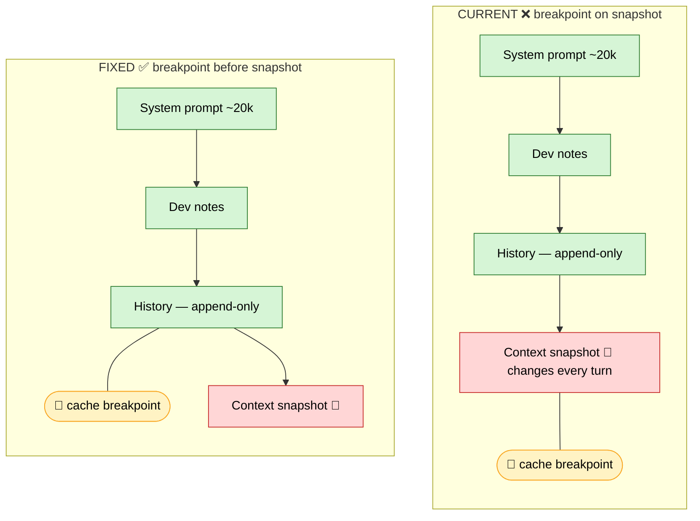
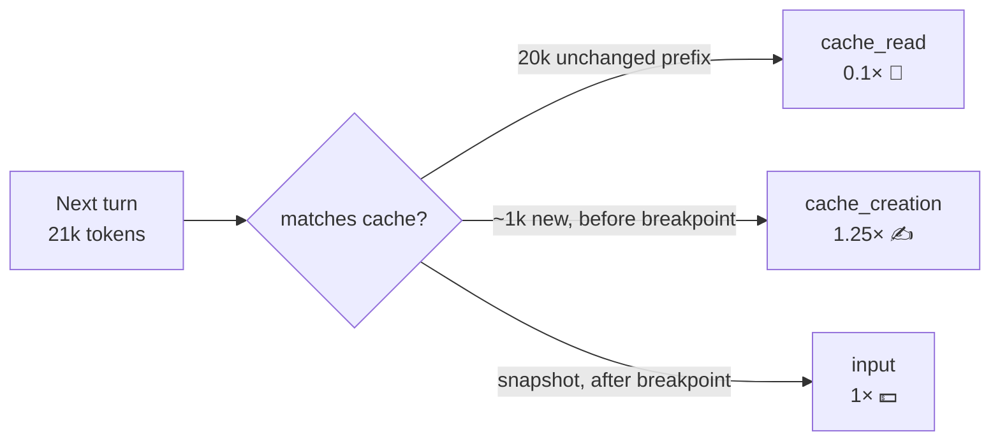

# Prompt Caching — Findings & Recommendation

_Last updated: 2026-06-09 · Status: Phase 1 implemented and verified live — `cache_read` ≈ 22.3k of a 23.4k prompt (~95%) on `anthropic/claude-sonnet-4.6`. History-caching (Phase 2) still pending._

Investigation into how prompt caching works for the agent's OpenRouter requests, what
we're doing wrong today, and the recommended fix. Written up from a team meeting where
several points were unresolved.

## 1. What "prompt caching" actually caches
"Prompt" = the **entire input** (`tools → system → all messages`), **not** just the system
instructions. Caching reuses **any prefix** of that, up to a breakpoint you choose. So
"cache the system prompt" and "cache the whole conversation history" are the **same
feature** at different breakpoint positions — the name is misleading. [1][2]

## 2. How billing works (incremental)
Every turn re-sends the whole prefix, billed in three parts:

| Part | Rate (× base input) |
|---|---|
| Unchanged prefix (cache **read**) | **0.1×** |
| New delta written this turn (cache **write**) | **1.25×** (5-min) / **2×** (1-hr) |
| Suffix after the last breakpoint (uncached) | **1×** |

You **never** pay full price on the tokens that repeat — only the delta is written. The
cache is **refreshed for free** every time it's hit (5-minute sliding window), so it stays
warm in an active session. [1]

Worked example — 20k cached, next turn 21k: the 20k bills at 0.1×, only the new ~1k is
written. Not 21k at full price. [1]

Opus 4.5 prices (per 1M tokens): input $5 · cache read **$0.50** · cache write $6.25 (5-min)
/ $10 (1-hr) · output $25. [1][7]

## 3. The bug in our current setup
Our message list is:

```
[ System prompt ~20k ]   stable
[ Dev notes ]            stable
[ Lightweight history ]  append-only (action names, NOT raw code)
[ Context snapshot ]     VOLATILE — code map + errors + tests, regenerated every turn, not persisted
```

The snapshot is appended **last** and changes every turn — and our single cache breakpoint
sits **on it**. So we write the whole prefix to cache every turn and almost never read it
back. This is **Anthropic-specific**: Anthropic makes you place the breakpoint yourself, and
ours is in the wrong place.



Everything **above** the breakpoint is cached (read at 0.1× next turn); everything below is
billed fresh.



## 4. The fix
- **Move the breakpoint before the snapshot**; never cache the snapshot.
- **Two breakpoints** (≤4 allowed): (a) on the system prompt → caches the static ~20k every
  turn; (b) before the snapshot → caches the accruing history, advancing each turn. [1]

## 5. The catch — context editing fights caching (a real constraint)
Caching is a **strict prefix match**: _"changes at each level invalidate that level and all
subsequent levels."_ So **editing the middle of history** — compaction, clipping stale code
views — **invalidates the cache from the edit point down**. Reads also only look back
**~20 content blocks** per breakpoint. [1][3]

Mitigation: keep history **append-only**, isolate the volatile code-state in the trailing
snapshot (we already do), and run compaction/cleanup as **infrequent batched passes**, not
per-turn, so the re-warm cost amortizes ("mostly monotonic + smart compaction").

## 6. Provider coverage — not uniform
| Provider | Mode | Read | Write |
|---|---|---|---|
| **Anthropic** (Claude 3+) | **Explicit** `cache_control` (you place it) | 0.1× | 1.25× / 2× (1-hr) |
| OpenAI (4o, o-series+) | Automatic (no markers) | ~0.25–0.5× | free |
| Google Gemini 2.5 | Implicit auto (1.5 = explicit, min 32k) | ~0.25× | storage-billed |
| DeepSeek | Automatic | 0.1× | free |
| xAI Grok | Automatic | discounted | free |

Anthropic is the **only** provider where you place the breakpoint yourself — which is why
this bug is ours alone; automatic providers exclude a trailing volatile block for free. Via
OpenRouter, caching is provider-specific (top-level auto-caching routes Anthropic-direct
only, not Bedrock/Vertex). Mechanics are stable but exact rates/thresholds/model lists shift
— verify current numbers per model. [1][4][5][6]

## 7. Recommendations
1. Move the breakpoint before the snapshot. **Biggest single win.**
2. Anchor the system prompt + an advancing history breakpoint.
3. Keep history append-only; batch compaction/clipping.
4. Commit cost-engineering to **Anthropic models** for now (only mode with placement control).
5. **Metrics:** track `cache_read` / `cache_creation` / `input` separately, not raw token
   count — the ~10× cached/uncached gap is the whole story.

## 8. Open items to verify
- OpenRouter read multiplier on a real invoice (Anthropic-direct 0.1×; possible 0.25×
  passthrough markup). [4]
- Minimum cacheable prefix for the chosen model (~1,024–4,096 tokens). Our ~20k system
  prompt clears it; very short chats may not cache. [1]

## Sources
1. [Anthropic — Prompt Caching](https://platform.claude.com/docs/en/build-with-claude/prompt-caching)
2. [Claude Code — Prompt Caching](https://code.claude.com/docs/en/prompt-caching)
3. [arXiv 2601.06007 — "Don't Break the Cache: An Evaluation of Prompt Caching for Long-Horizon Agentic Tasks"](https://arxiv.org/abs/2601.06007)
4. [OpenRouter — Prompt Caching](https://openrouter.ai/docs/guides/best-practices/prompt-caching)
5. [PromptHub — Prompt Caching with OpenAI, Anthropic, and Google Models](https://www.prompthub.us/blog/prompt-caching-with-openai-anthropic-and-google-models)
6. [OpenAI — Prompt Caching](https://developers.openai.com/api/docs/guides/prompt-caching)
7. [OpenRouter — Claude Opus 4.5](https://openrouter.ai/anthropic/claude-opus-4.5)
