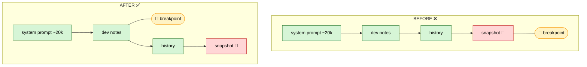

# Prompt Caching — Research Report & Findings

_Living document. Audience: research team / advisors. Covers the full investigation into
prompt caching for the Hazel coding agent on OpenRouter, including the reasoning, the
hypotheses we tested and rejected, the diagnostic methodology, the definitive evidence, the
root cause, and open next steps._

- **2026-06-09** — Phase 1 shipped & verified live (~95% cache reads on `anthropic/claude-sonnet-4.6`).
- **2026-06-18** — Phase 2 (advancing history breakpoint) implemented.
- **2026-06-23/28** — Built a diagnostic harness; **proved Phase 2 is blocked by OpenRouter's
  OpenAI-compat path** for the message role our breakpoint landed on (tool results).
- **2026-06-28** — Correction: OpenRouter docs *do* support `cache_control` on **user** messages;
  experiment in progress to re-anchor on user messages.

---

## 0. TL;DR for the team

- **Prompt caching** lets us re-send a long, mostly-unchanged prompt each turn and pay ~0.1× input
  price on the unchanged prefix instead of 1× — roughly **10× cheaper input per turn** on the
  cached portion.
- **Phase 1 (live, working):** one cache breakpoint on the stable `tools + system prompt + dev-notes`
  prefix. Caches **~93% of a typical payload** (~22.3k of ~24k tokens). This is the big win and it
  works.
- **Phase 2 (attempted):** a second, *advancing* breakpoint to also cache the **growing
  conversation history**. On OpenRouter+Anthropic this **does not work** — but **not because our
  code is wrong**. We proved with a diagnostic harness that our serialization is byte-correct and
  the breakpoint is on the wire; OpenRouter's gateway drops it.
- **Root cause:** OpenRouter routes Anthropic models through an **OpenAI-compatible wire format**.
  In that translation, `cache_control` is honored on **system** and **user** messages but **dropped
  on `tool` (tool-result) messages** — which is exactly where our advancing breakpoint landed in an
  agentic tool loop.
- **Status:** experiment in progress to move the advancing breakpoint onto the **last user message**
  (a role OpenRouter documents as supported). If it works, we recover cross-turn history caching.

---

## 1. Background: how prompt caching works

Caching is a **strict prefix match** over the fully-rendered request. The render order is:

```
tools  →  system  →  messages[]   (this whole sequence is the "prompt")
```

A `cache_control: {"type": "ephemeral"}` **breakpoint** marks a position. Everything *before* the
breakpoint is cached cumulatively. On the next request, if that same prefix is re-sent **byte-for-
byte**, it is served from cache.

Billing per turn (Anthropic):

| Portion of the request | Price |
|---|---|
| Unchanged prefix re-read from cache | **~0.1×** input |
| New tokens written into the cache this turn (the delta) | **~1.25×** input (5-min TTL) / **2×** (1-hr TTL) |
| Tail after the last breakpoint (e.g. our volatile snapshot) | **1×** input |
| Output tokens | normal output price |

Key properties (all load-bearing for this investigation):

- **Strict prefix match.** A single byte change *anywhere* in the prefix invalidates everything
  after it. Timestamps, reordered JSON keys, a changed tool list → cache miss.
- **Breakpoint = boundary annotation, not content.** The `cache_control` marker itself is not part
  of the cached tokens; it just declares a cache boundary. (This is why the *content* must be
  byte-stable, but moving the marker around is fine.)
- **20-block lookback.** Each breakpoint walks back at most ~20 content blocks to find a prior cache
  entry. Long single turns (many tool-call/result pairs) can blow past this.
- **Max 4 breakpoints** per request.
- **5-minute sliding TTL**, refreshed free on every hit.

### What "the prompt" means (a recurring team question)
"The prompt" is the **entire input** (`tools → system → all messages`), not just the system prompt.
"Cache the system prompt" and "cache the history" are the *same feature* at different breakpoint
positions. A breakpoint near the end caches everything before it cumulatively.

---

## 2. Phase 1 — the original fix (live, verified)

### The bug
Our single cache breakpoint sat on the **context snapshot** — a per-turn snapshot of live program
state, appended *last* and regenerated every turn. Because caching is a prefix match, a breakpoint
on volatile last content gets ≈ zero hits: we paid the 1.25× write premium every turn and almost
never read it back.

### The fix
Moved the breakpoint **off the snapshot** onto the stable **dev-notes** message (which sits right
after the system prompt). Now the prefix `tools + system prompt + dev-notes` caches across turns.
The snapshot stays last and uncached.



### Result (verified live)
`cache_read 22,293 / prompt 23,436` → **~95% of every request served at 0.1×** (~10× cheaper input
per turn). Implemented via a `cache_anchor` flag on the OpenRouter message type (`OpenRouter.re`)
set on the dev-notes message (`Message.re`).

---

## 3. Phase 2 — advancing history breakpoint (the investigation)

### 3.1 Goal
Phase 1 caches the *static* prefix. Phase 2 wanted to also cache the **growing conversation** so
prior history reads at 0.1× instead of full price. Design (per the spec):

1. **Advancing breakpoint.** Each request, place a second `cache_control` on the **last history
   message**, just before the volatile snapshot. This position moves forward every request; the
   20-block lookback finds the previous request's write.
2. **Mark every request, not every user turn.** Agentic loops issue one API request per tool
   round-trip; marking every request keeps consecutive writes 1–3 blocks apart (inside the lookback
   window).
3. **Keep the Phase 1 dev-notes breakpoint as a floor.** When a lookback window is exhausted, the
   search resumes at the next earlier explicit breakpoint. Worst case degrades to Phase 1 pricing.
4. **History must stay byte-stable and append-only.** Any mid-history edit invalidates the cache
   from that point down.
5. **Per-conversation `session_id`.** Pins OpenRouter sticky routing to one provider so the cache
   (which does not transfer between Anthropic/Bedrock/Vertex) keeps hitting.

### 3.2 Implementation
- `Chat.api_messages_for_openrouter` (`src/web/view/agentCore/Chat.re`) — sets the advancing
  `cache_anchor` and is the single chokepoint routed through by all 4 main request paths (initial,
  follow-up, API-error retry, empty-reply retry) plus compaction.
- `OpenRouter.json_of_message` (`src/util/OpenRouter.re`) — renders the marker. Non-blank content is
  rendered as a stable single-element `[{type:text,...}]` array (see §3.4) and the `cache_control`
  key is toggled on/off.
- `OpenRouter.Payload` — added an optional top-level `session_id` body field, threaded from the chat
  id at every request path.
- `supports_cache_control` — provider gate widened from `anthropic/` only to `anthropic/`,
  `google/`, `qwen/` (the families documented to support explicit breakpoints with identical
  syntax). Auto-caching providers (OpenAI/DeepSeek/Grok) get the field stripped.

### 3.3 Symptom
Cache reads stayed pinned at the Phase 1 floor (~22.3k) while the conversation grew; the growing
history was never cached. `cache_creation` was `null` on every request — i.e. **nothing was ever
written to cache beyond the floor.**

### 3.4 Hypotheses tested and **rejected** (the reasoning trail)

This is the part worth keeping for the team — we ruled out several plausible client-side causes
before landing on the provider:

1. **"The advancing breakpoint flips a message between string and array form as it stops being the
   anchor, breaking byte-stability."** Plausible: our default rendered content as a JSON *string*
   and only the anchored message as a `[text]` array, so a just-anchored message flipped
   `array → string` next request. **Fix applied:** always render non-blank content as a `[text]`
   array and toggle only the `cache_control` key, so a message serializes identically whether or not
   it holds the marker. **Result: no change** — cache still flat. → Rejected as the cause.
2. **"The advancing breakpoint isn't being placed at all."** Tested by logging the breakpoint
   indices on the wire. **Result: `breakpoints=[1,N]`** — both the floor (1) and the advancing
   breakpoint (N) *are* present. → Rejected.
3. **"Our message bytes are unstable / not append-only."** Tested by computing the byte-stable
   common prefix vs. the previous request. **Result: common prefix grows append-only** (43,436 →
   44,505 chars). → Rejected; our serialization is correct.
4. **"Minimum cacheable size / 20-block lookback gap."** The incremental delta exceeded the minimum,
   and we mark every request (1–3 blocks apart), so the lookback isn't exhausted. → Not the cause.

After rejecting all client-side causes, the remaining explanation was provider-side: **the marker
reaches OpenRouter but is not honored.**

### 3.5 The diagnostic harness (`OpenRouter.CacheDiag`)
To separate "are *our* bytes correct?" from "did the *provider* cache them?", we built a harness
(`src/util/OpenRouter.re`, module `CacheDiag`, **off by default** — set `log := true`). Per request
it logs:

- **breakpoint indices** carrying `cache_control` on the wire,
- the **byte-stable common prefix** of message *content* vs. the previous request (deliberately
  ignoring the moving `cache_control` marker, so it measures content stability),
- the response's **`cache_read` / `cache_creation`**.

Interpretation:
- common prefix **grows** + cache_read **flat** → our bytes are fine, **provider dropped the
  breakpoint**.
- common prefix **falls/jumps** → a client-side serialization instability (it didn't).

### 3.6 Definitive evidence

**`anthropic/claude-sonnet-4.6` (the target case):**
```
breakpoints=[1,4]   common_prefix=0ch      payload=44069ch  cache_read=22293  cache_creation=null
breakpoints=[1,6]   common_prefix=43436ch  payload=44299ch  cache_read=22293  cache_creation=null
breakpoints=[1,8]   common_prefix=43708ch  payload=44526ch  cache_read=23081  cache_creation=null
breakpoints=[1,10]  common_prefix=43935ch  payload=44909ch  cache_read=22293  cache_creation=null
breakpoints=[1,12]  common_prefix=44241ch  payload=45221ch  cache_read=22293  cache_creation=null
breakpoints=[1,14]  common_prefix=44505ch  payload=45862ch  cache_read=22293  cache_creation=null
```
Reading it:
- `breakpoints=[1,N]` → **both** markers on the wire; we *do* send the advancing breakpoint.
- `common_prefix` climbs append-only → our serialization is **byte-stable and correct**.
- `cache_read` pinned at the floor (~22,293), `cache_creation` always `null` → the provider **never
  caches the growing history**.

**`google/gemini-3-flash-preview` (cross-check):**
```
breakpoints=[1,4]   common_prefix=0ch      cache_read=0      cache_creation=null
breakpoints=[1,6]   common_prefix=43496ch  cache_read=15364  cache_creation=null
breakpoints=[1,8]   common_prefix=43688ch  cache_read=0      cache_creation=null
```
Erratic `cache_read` (0 → 15,364 → 0), `cache_creation` null — Gemini's **implicit** automatic
caching doing best-effort, *not* driven by our explicit markers. Outside our control.

### 3.7 Root cause
**OpenRouter routes Anthropic models through an OpenAI-compatible wire format
(`chat_completions`).** In that translation, Anthropic honors `cache_control` only on certain
message roles; markers on others are silently dropped. Our **floor** sits on a **system** (dev-notes)
message → honored (22.3k cached). Our **advancing** breakpoint lands on a **`tool` (tool-result)**
message in the agentic loop → **dropped** → no write (`cache_creation: null`), no incremental read.

This is **not an Anthropic limitation** — Anthropic natively supports cumulative multi-turn history
caching. It is a property of OpenRouter's gateway translation. Corroborated by multiple independent
third-party reports (see Sources).

### 3.8 Correction (important — the "only system" claim was too strong)
After the diagnosis we re-read OpenRouter's **official** prompt-caching docs. They show
`cache_control` examples on **both system AND user messages**:

```json
{ "role": "user", "content": [
  { "type": "text", "text": "Given the book below:" },
  { "type": "text", "text": "HUGE TEXT BODY", "cache_control": { "type": "ephemeral" } }
]}
```

So the documented support is **system + user** (assistant: not shown; **tool/tool_result: not shown
anywhere**). Our failure is therefore specific to the breakpoint landing on a **tool** message — the
one undocumented role — **not** a blanket "non-system" wall. The earlier "only system works" framing
came from third-party GitHub issues and over-generalized; our own data only *proves* the tool case
fails.

---

## 4. Current experiment (in progress)

**Hypothesis:** anchoring the advancing breakpoint on the **last user message** (a documented,
supported role) instead of the tool result will let cumulative history cache.

**Change:** `Chat.api_messages_for_openrouter` now sets `cache_anchor` on the **last user message**
in the request rather than the last message before the snapshot.

**Expected behavior:**
- ✅ Caches everything up to the latest user turn; **grows across user turns** (the main
  long-conversation win).
- ⚠️ Tool-loop results that accumulate *after* the last user message within a single turn stay
  uncached — because they're `tool` messages. So a **single-turn, tool-heavy** run (like the fib
  test) will *not* show growth; you must test **multi-turn** (send a message, let it finish, send
  another) and watch `cache_read` climb across turns.

**How to verify:** set `CacheDiag.log := true` (currently on for this experiment), run a **multi-turn**
conversation on `anthropic/claude-sonnet-4.6` with DevTools console open, and read the `CACHE_DIAG`
lines:
- `cache_read` climbing above the floor across turns → **user-anchor works**, recover cross-turn caching.
- `cache_read` still flat → user-anchor also dropped; fall back to floor-only.

**If it works**, the deeper fix for the *intra-turn tool loop* (the dominant cost pattern in this
app) is to deliver **tool results as `user` messages** containing `tool_result` content blocks
(Anthropic's native shape) instead of `role: "tool"` — so the accumulating tool history sits on a
supported role. That is a larger, riskier protocol change and is deferred until the user-anchor
result is in.

---

## 5. Where caching helps vs. doesn't (cost model)

| Scenario | Floor (Phase 1) | Advancing history (Phase 2) |
|---|---|---|
| Static prefix (tools + system + dev-notes) | ✅ cached ~22.3k | n/a |
| Multi-turn chat (prior user/assistant turns) | floor only | ✅ *if* user-anchor works (§4) |
| Single-turn agentic tool loop (accumulating tool results) | floor only | ❌ tool messages dropped by OpenRouter |
| Volatile per-turn snapshot (last message) | never cached (by design) | never cached (by design) |

**Practical takeaway:** Phase 1 already controls the bulk of cost (~93% of payload). Phase 2's
marginal value is large only for **long multi-turn** conversations; for short or single-turn-tool-
heavy sessions it adds little even in the best case.

---

## 6. Cross-provider caching matrix (OpenRouter)

| Provider | Mechanism | Min size | Write | Read |
|---|---|---|---|---|
| **Anthropic** | explicit `cache_control` (what we use) | 1,024–4,096 tok by model | 1.25× (5-min) / 2× (1-hr) | 0.1× |
| **Google Gemini** | explicit (Gemini standard) / implicit (2.5) | model-specific | input + storage | discounted |
| **Alibaba Qwen** | explicit `cache_control` | — | charged multiplier | discounted |
| **OpenAI** | automatic / implicit | 1,024 tok | **free** | 0.25×–0.5× |
| **DeepSeek / Grok / Moonshot / Groq** | automatic / implicit | — | free | discounted |

Auto-caching providers ignore (don't error on) the `cache_control` field; OpenRouter strips it for
non-allowlisted providers in our code regardless.

---

## 7. Constraints & gotchas (carry-forward)

- **Strict prefix match** — editing mid-history (compaction, clipping stale views, re-rendering)
  invalidates everything below the edit. Keep history append-only; batch edits.
- **Deterministic serialization** — unstable JSON key ordering (e.g. in tool-call args) silently
  breaks caching. We serialize args once and reuse them.
- **Don't mark thinking blocks** — they can't carry `cache_control`; cached implicitly with
  surrounding content. (We never send thinking blocks upstream anyway.)
- **OpenRouter role limitation** — `cache_control` honored on **system + user** (documented), not on
  **tool** (empirically dropped). This is the crux of Phase 2.
- **Sticky routing** — caches don't transfer between Anthropic/Bedrock/Vertex; `session_id` pins one
  provider.

---

## 8. Open questions / next steps

1. **(Active) Does user-message anchoring cache cross-turn history on OpenRouter+Anthropic?** —
   verify via the harness on a multi-turn run.
2. **Do `assistant` messages honor `cache_control` on OpenRouter?** — undocumented; testable with the
   harness if needed.
3. **Tool-result-as-user-message** — deliver tool results in Anthropic's native `user` + `tool_result`
   shape so the intra-turn tool loop caches. Larger change; gated on (1).
4. **Native-Anthropic routing** — bypass OpenRouter's OpenAI-compat path entirely (separate
   endpoint/key) so per-block `cache_control` on all roles is honored. Most reliable, most work.
5. **1-hour TTL** for >5-min think-gaps; confirm OpenRouter's real read rate on an invoice.

---

## 9. Code / file map

| Concern | Location |
|---|---|
| `cache_anchor` flag on the OpenRouter message type | `src/util/OpenRouter.re` (`Message.Model.t`) |
| Marker rendering (multipart `[text]` + `cache_control` toggle) | `src/util/OpenRouter.re` (`json_of_message`) |
| Provider gate (`anthropic/`, `google/`, `qwen/`) | `src/util/OpenRouter.re` (`supports_cache_control`) |
| Top-level `session_id` body field | `src/util/OpenRouter.re` (`Payload`) |
| Diagnostic harness | `src/util/OpenRouter.re` (`CacheDiag`, off by default) |
| Floor anchor on dev-notes | `src/web/view/agentCore/Message.re` (`mk_developer_notes_message`) |
| Advancing anchor placement | `src/web/view/agentCore/Chat.re` (`api_messages_for_openrouter`) |
| Request dispatch paths (all routed through the helper) | `src/web/view/agentCore/AgentUpdate.re` |
| Per-message token + cache chip UI | `src/web/view/agentView/ChatMessagesView.re` (`render_token_chip`) |

---

## 10. Sources

- [1] [Anthropic — Prompt Caching](https://platform.claude.com/docs/en/build-with-claude/prompt-caching)
- [2] [Claude Code — Prompt Caching](https://code.claude.com/docs/en/prompt-caching)
- [3] [arXiv — "Don't Break the Cache"](https://arxiv.org/abs/2601.06007)
- [4] [OpenRouter — Prompt Caching (best practices)](https://openrouter.ai/docs/guides/best-practices/prompt-caching) — documents `cache_control` on **system + user** messages
- [5] [PromptHub — provider caching comparison](https://www.prompthub.us/blog/prompt-caching-with-openai-anthropic-and-google-models)
- [6] [OpenRouter Gemini caching announcement](https://x.com/OpenRouterAI/status/1914699401127157933)
- [7] [litellm #15345 — "move cache_control to content blocks for claude/gemini"](https://github.com/BerriAI/litellm/pull/15345)
- Third-party reports of OpenRouter+Anthropic non-system `cache_control` being dropped:
  [Zed #52576](https://github.com/zed-industries/zed/issues/52576) ·
  [OpenRouter ai-sdk-provider #35](https://github.com/OpenRouterTeam/ai-sdk-provider/issues/35) ·
  [opencode #1245](https://github.com/anomalyco/opencode/issues/1245)
